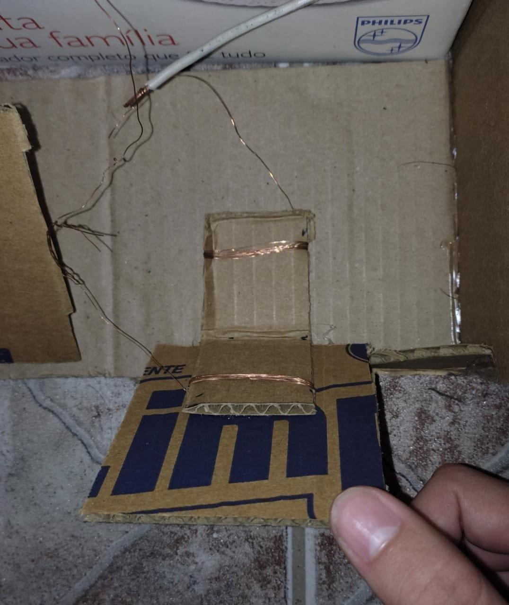

# Simulador_ETS2

# Materials
- Arduino Micro
- CardBoard
- Copper Wire


# Features
- Steering Wheel
- Throttle
- Brake
- Sequential Clutch
- Headlights(?)

## Pull Up button with Copper Wire
Using copper wire is easier than using switch buttons, because we can mold its shape and adapt to any situation where is necessary a "0" or "1" as input.
The basic code is shown below:
```c++
  #define in 2
  void setup() {
    Serial.begin(9600);
    pinMode (in, INPUT_PULLUP);
  }
  void loop() {
    if(digitalRead() == 0){
      Serial.println("Pressed!")
    }
  }
```
This logic is used for the _headlights(?)_, sequencial clutch, throttle and brake.

